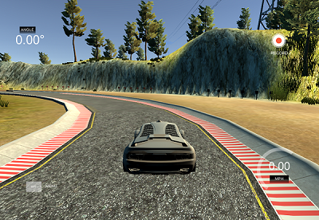

# **Behavioral Cloning** 

## Writeup Template

### You can use this file as a template for your writeup if you want to submit it as a markdown file, but feel free to use some other method and submit a pdf if you prefer.

---

**Behavioral Cloning Project**

The goals / steps of this project are the following:
* Use the simulator to collect data of good driving behavior
* Build, a convolution neural network in Keras that predicts steering angles from images
* Train and validate the model with a training and validation set
* Test that the model successfully drives around track one without leaving the road
* Summarize the results with a written report


[//]: # (Image References)

[image1]: ./examples/structure.png
[image2]: ./examples/driving.png
[image3]: ./examples/hist_1.png
[image4]: ./examples/hist_2.png
[image5]: ./examples/center.png
[image6]: ./examples/left.png
[image7]: ./examples/right.png

---
### Files Submitted & Code Quality

#### 1. Submission includes all required files and can be used to run the simulator in autonomous mode

My project includes the following files:
* model.py containing the script to create and train the model
* drive.py for driving the car in autonomous mode
* model.h5 containing a trained convolution neural network 
* writeup_report.md or writeup_report.pdf summarizing the results

#### 2. Submission includes functional code
Using the Udacity provided simulator and my drive.py file, the car can be driven autonomously around the track by executing 
```sh
python drive.py model.h5
```

#### 3. Submission code is usable and readable

The model.py file contains the code for training and saving the convolution neural network. The file shows the pipeline I used for training and validating the model, and it contains comments to explain how the code works.

### Model Architecture and Training Strategy

#### 1. Creation of the Training Set & Training Process

Training data was chosen to keep the vehicle driving on the road. I used a combination of center lane driving, recovering from the left and right sides of the road.



Data collection is the first important part. As in project requirement, data collection can only performed on Track 1. I decided to use Udacity sample data as starting point. Data balance is the key, because there were not enough strong left and right steering moments in this training data. To create such images and steerings, I looked for the existing strong steerings, then employed the left / right camera images with a further steering adjustment 0.25. 

![alt text][image5] "Center camera"
![alt text][image6] "Left camera"
![alt text][image7] "Right camera"

For example, to get a strong left steering image, I looked for a good left steering image (steering angle < -0.1) and paired its corresponding right camera image with (existing steering - 0.25). The result is a stronger left steering moment.

Distribution of steering angles before

![alt text][image3]

and after adding strong steerings

![alt text][image4]

To further augment the data set, I also flipped images and angles thinking that this would make the model generalized for both left and right turnings. Others things I did were 

1. Cropping images to remove the sky and front deck
2. Resize the images to 64x64 to reduce the number of parameters in my model
3. Randomly adjusting the brightness of the images to increase robustness.

I finally randomly shuffled the data set and put 10% of the data into a validation set. I used this training data for training the model. The validation set helped determine if the model was over or under fitting.

#### 2. Solution Design Approach

The overall strategy for deriving a model architecture was to estimate correctly the steering angle based on a given image taken from the car. 

Input images are normalized in the model using a Keras lambda layer at the input layer, and the model includes RELU layers to introduce nonlinearity. 

At first I tried the simple LeNet model, but that doesn't work very well. So I started to use the base model [End to End Learning for Self-Driving Cars](http://images.nvidia.com/content/tegra/automotive/images/2016/solutions/pdf/end-to-end-dl-using-px.pdf) by Nvidia as a base and keep tuning.

In order to gauge how well the model was working, I split my image and steering angle data into a training and validation set. I found that my first model had a low mean squared error on the training set but a bit higher mean squared error on the validation set. This implied that the model was overfitting.

There are totally five convolutional layers and three fully connected layers leading to an output control value which is the steering angle. I used strided convolutions in the first three convolutional layers with a 2×2 stride and a 5×5 kernel and a non-strided convolution with a 3×3 kernel size in the last two convolutional layers.

To combat the overfitting, the model contains dropout layers in order to reduce overfitting. In addition, L2 kernel regularization were added at every layers to increase robustness. The model was trained and validated on different data sets to ensure that the model was not overfitting. The model was tested by running it through the simulator and ensuring that the vehicle could stay on the track, as a requirement to pass this test.

Here is the architecture

![alt text][image1]

The ideal number of epochs was 5 as further training does not substantially improve the performance in validation error. I used an adam optimizer so that manually training the learning rate wasn't necessary.

#### 3. Performance

The final step was to run the simulator to see how well the car was driving around track one. To improve the driving behavior in these cases, I did some further fine tuning in the steering adjustment on left/right camera images.

At the end of the process, the vehicle is able to drive autonomously around the track without leaving the road.


